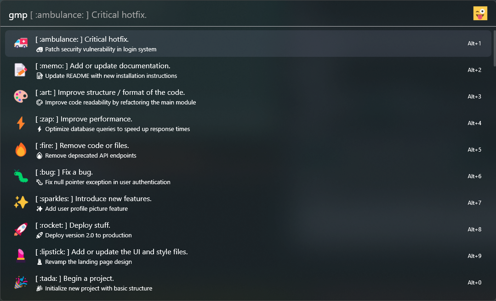

<div align="center">
    <div>
        <a href="https://github.com/Flow-Launcher/Flow.Launcher.PluginsManifest">
            
        </a>
        <a href="https://github.com/tho-myr/Flow.Launcher.Plugin.Gitmoji_Plus/issues">
            
        </a>
        <a href="https://github.com/tho-myr/Flow.Launcher.Plugin.Gitmoji_Plus/pulls">
            
        </a>
        <a href="https://github.com/tho-myr/Flow.Launcher.Plugin.Gitmoji_Plus/commits">
            
        </a>
    </div>
</div>

<br>

<div align="center">
  <br>
  <br>
  <h1 style="margin-bottom: 0">Gitmoji Plus - Quickly search and copy Gitmojis</h1>
  <p>
    based on original 
    <a href="https://github.com/Galedrim/Flow.Launcher.Plugin.Gitmoji">gitmoji plugin</a>
    by 
    <a href="https://github.com/Galedrim">Galedrim</a> 🥰
  </p>
</div>

<br>

> [!NOTE]
>
> Feel free to leave suggestions or report bugs in the [issues](https://github.com/tho-myr/Flow.Launcher.Plugin.Gitmoji_Plus/issues) section. 
> Or fork the project and create a pull request with your own changes ^-^

A plugin to search for gitmojis with [flow launcher](https://github.com/Flow-Launcher/Flow.Launcher). 
Inspired by the original but apparently unmaintained [gitmoji plugin](https://github.com/Galedrim/Flow.Launcher.Plugin.Gitmoji). 
Written in C# for native flow launcher support and better perfomance. 
Original plugin was written in python but lacked a few emojis and was quite slow.


### Installation

1. Install [flow launcher](https://github.com/Flow-Launcher/Flow.Launcher) if you haven't already.
2. Execute the following command in flow launcher to install the plugin.

```cmd
pm install Gitmoji Plus by tho-myr
```

### Usage

```cmd
gmp <search_query>
```



### Development

#### Prerequisites

- Install dotnet version <=7.x.x from Microsoft [here](https://dotnet.microsoft.com/en-us/download). 
- Install latest version of [flow launcher](https://github.com/Flow-Launcher/Flow.Launcher). (default installation path is recommended for faster testing)

#### Build project

Run the following command in the root folder of the repository/project.

Exit [flow launcher](https://github.com/Flow-Launcher/Flow.Launcher), build with `dotnet build` 
and then restart [flow launcher](https://github.com/Flow-Launcher/Flow.Launcher)

```cmd
dotnet build
```

> [!WARNING]
> The output folder during `dotnet build` is set to the default flow launcher installation path.
> 
> ```$(UserProfile)\AppData\Roaming\FlowLauncher\Plugins\Gitmoji Plus-DEBUG\```
>
> To build the project in the project directory remove or comment out the following line from [Flow.Launcher.Plugin.Gitmoji_Plus.csproj](Flow.Launcher.Plugin.Gitmoji_Plus/Flow.Launcher.Plugin.Gitmoji_Plus.csproj).
>
> ```<OutputPath>$(UserProfile)\AppData\Roaming\FlowLauncher\Plugins\Gitmoji Plus-DEBUG\</OutputPath>```
>
> If commented out you have to manually paste the build files from the folder `/Flow.Launcher.Plugin.Gitmoji_Plus/bin/Debug` to the plugin folder of your [flow launcher](https://github.com/Flow-Launcher/Flow.Launcher) installation.

### Release plugin

1. Update [CHANGELOG.md](CHANGELOG.md) for new release.
2. Update version in [plugin.json](Flow.Launcher.Plugin.Gitmoji_Plus/plugin.json)
3. Merge changes into `master` branch
4. Create the tag `v1.x.x` on the merge commit on the `master` branch and the release will be built by github actions
5. Follow the steps [here](https://github.com/Flow-Launcher/Flow.Launcher.PluginsManifest?tab=readme-ov-file#how-to-submit-your-plugin) to submit plugin 

### Inspiration

Love to the developer of the original [gitmoji plugin](https://github.com/Galedrim/Flow.Launcher.Plugin.Gitmoji). 
I took a lot of inspiration from their plugin and would like to thank them here <3

Thanks for using my plugin or reading through this long-ass readme. love yall (づ ◕‿◕ )づ